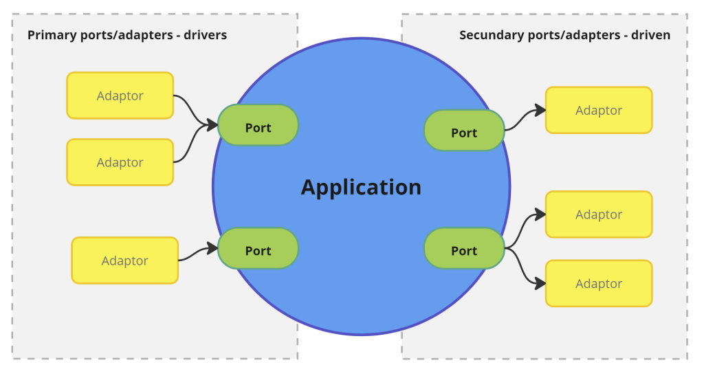
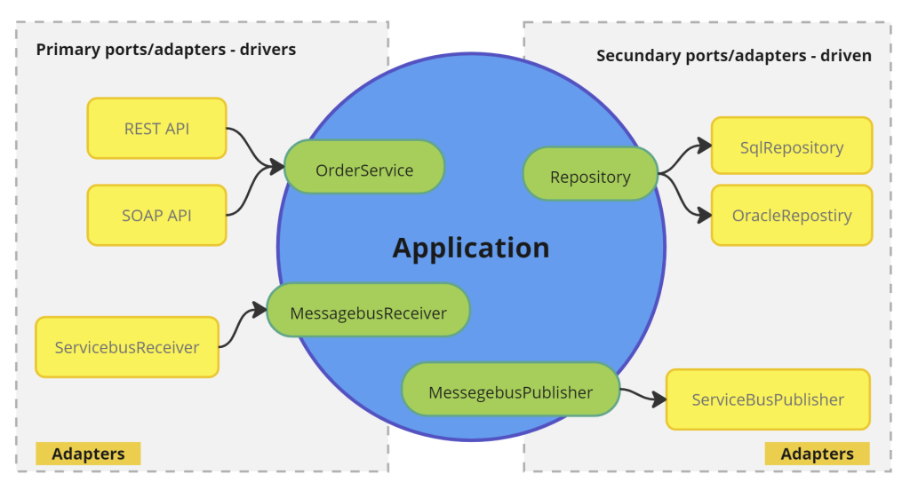
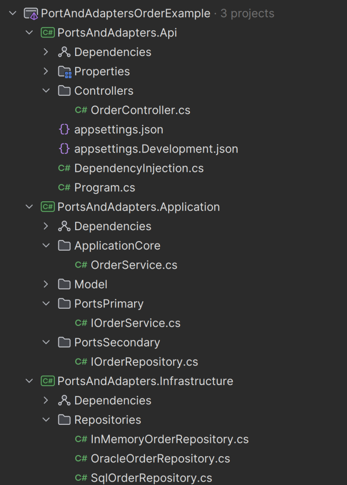
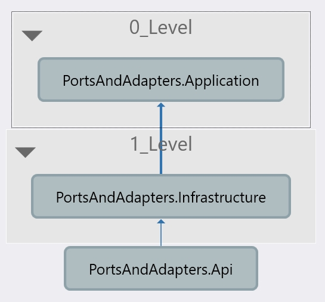
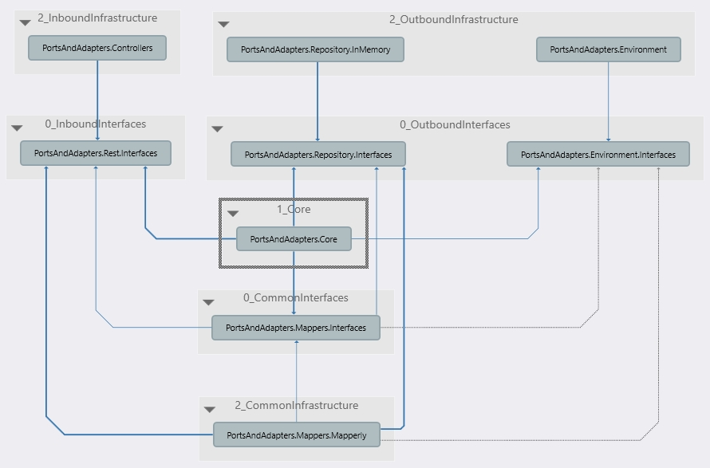
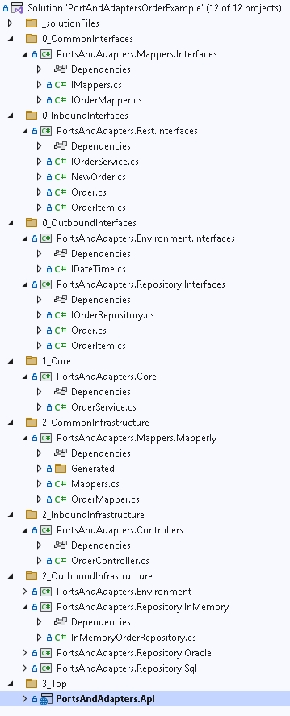

# Ports and Adapters Architecture (Hexagonal) Example in C#/.NET Core

This is an example implementation of the Ports and Adapters Architecture (Hexagonal architecture), in C#.

В `src1` лежит версия исходника из https://github.com/baswanders/PortAndAdaptersArchitectureHexagonalExampleC.
Я его только немного причесал.

## Basic idea

The idea is to separate the core application logic from the external dependencies, such as databases, web services, etc. This way, the core application logic is not dependent on any external technology, and can be easily tested in isolation.

## Notes

Mind you that this example only shows the implementation of this architecture. It does not try to incorporate best practices of any other kind.

# Ports and Adapters (Hexagonal) Architecture in C#

*Исходная статья: https://baswanders.com/ports-and-adaptors-hexagonal-architecture-in-c/*

*Последнее изменение: July 27, 2024 by Bas Wanders*

The Ports and Adapters architecture, also known as the Hexagonal Architectural Pattern, is a design pattern intended to create loosely coupled application components that can be easily tested and maintained.

This concept was developed by Alistair Cockburn in 2005, and you can find the original article
[here](https://alistair.cockburn.us/hexagonal-architecture/).

### Learn to walk before you run

Is it still relevant after nearly 20 years? Absolutely. It remains a foundational concept, underpinning more complex architectures like Clean Architecture and Onion Architecture.

While these latter approaches can spark endless debates and even more attempts to implement, the Ports and Adapters architecture offers a more straightforward path, once you grasp its principles.

The Ports and Adapters architecture is a good base to start a new project. It keeps your application clean of implementation details. It can evolve later in a more elaborated architecure if needed.

### What is the goal of the Ports and Adapters Architecture?

What was the original goal of Alistair Cockburn:

>Allow an application to equally be driven by users, programs, automated test or batch scripts, and to be developed and tested in isolation from its eventual run-time devices and databases.

Let's analyze the keywords in this sentence:

1. Application

- Develop and test in isolation

2. Input

- Users
- Programs
- Automated test
- Batch scripts

3. Eventual resources

- Run-time devices
- Database

The center is an application, we want to develop and test this application without external dependencies (isolated from...), the application can be used by one or more input sources.

## Core Concepts

### Application

The heart is the application, where the logic resides. It is completely independent of any external system or technologies.

What many people miss, is that this pattern does not prescribe what is inside the (core) application. We only know it contains the core logic.

### Ports

The application has “Ports” that define how the application core interacts with the outside world. What is important to note is that ports are part of the application. They are “inside” so to say.

There are two main types of ports:

**Primary Ports**

Define how external agents (like users, external applications, tests) can interact with the application. These are also called “Drivers”, because they start a flow in the application.

**Secondary Ports**

Define how the application interacts with external systems (like databases, messaging services, web services). These are also call “Driven ports”, because they react to request of the application.

### Adapters

Adapters are the implementations of the ports. They translate between the external world and the core application logic. Adaptors are outside of the application core.

**Inbound Adapters**

Implement the inbound ports to facilitate interaction with external agents (e.g., REST controllers, message listeners).

**Outbound Adapters**

Implement the outbound ports to connect with external systems (databases, notification service, third-party services).

## Structure with implementation details

## Key Principles

### Separation of Concerns

Application logic is separated from the infrastructure code, allowing each to evolve independently.

There is no external logic in the core.

### Testability

Since the core logic is isolated from external systems, it can be tested in isolation, leading to more reliable and maintainable tests.

### Flexibility and Adaptability

Changes in the external systems (like switching databases or external services) require only changes in the adapters, leaving the core logic untouched.

## Example in C#/.NET Core

You can find the example implementation with C# on GitHub

https://github.com/baswanders/PortAndAdaptersArchitectureHexagonalExampleC

>*Примечание: в 'src1' находится "причесанная" версия*

Here is a quick overview of the project structure:

The solution contains 3 projects:

- **Application** – core application logic
- **Api** – Rest api representing the driver adapter
- **Infrastructure** – Implementations of repository. The driven adapter implementation

### Application project

- Has no external reference or NuGet packages
- Contains only core application logic
- Defines the ports as Interfaces

### Api project

- Is the REST API implementation of the order service adapter
- Contains a DependencyInjection file where register the implemented services for each interfaces.
- Has a reference to the Application project and Infrastructure project

### Infrastructure project

- This contains the implementation of the secondary ports or driven ports
- In this project we have 3 implementations of the IOrderRepository
- In the Api DependencyInjection we choose one of the implementations to be used.
- The infrastructure project has external NuGet packages

## Conclusion

Despite (or because of) it’s age, the Ports and Adapter/Hexogonal architecture gives a solid base for any project. Also for existing projects it is good to strive. It promotes seperation of concerns and makes your application code testable.

## Resources

- [Example C# implementation on GitHub](https://github.com/baswanders/PortAndAdaptersArchitectureHexagonalExampleC)

- [Original article of Alistair Cockburn](https://alistair.cockburn.us/hexagonal-architecture/)

- [In dept information from Juan Manuel Garrido de Paz](https://jmgarridopaz.github.io/content/hexagonalarchitecture.html)

# Более навороченная структура

Разнес код из предыдущего примера по разным проектам.

Новая версия расположена в [src2](/src2)

Упрощенный вид зависимостей проектов:

Структура всего solution:

